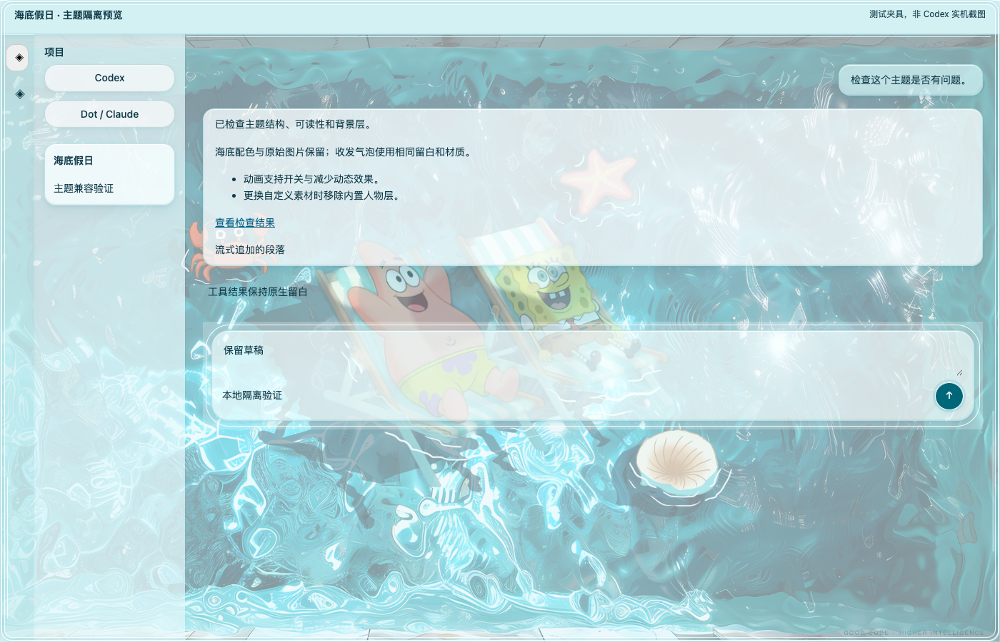

# 海底假日·海绵宝宝 v1.0.2

浠浠（xixi）设计的个人共创主题。保留原图、作者署名、主题 ID 和独立设置键，将修复版加入首页主题展示区与[主题独立下载](THEMES.md)。

[下载 ZIP](https://github.com/yubowen123/AIYOUCODEX/releases/download/v1.5.1/aiyoucodex-theme-spongebob-beach-motion-xixi-v1.0.2.zip) · [SHA-256 校验文件](https://github.com/yubowen123/AIYOUCODEX/releases/download/v1.5.1/aiyoucodex-theme-spongebob-beach-motion-xixi-v1.0.2.sha256) · [源文件与安装说明](../themes/spongebob-beach-motion/README.md)

本主题使用图片分层与 CSS 动画。首次启动为完整静态图片，可开启人物轻摆和水面微光；已有保存的动效选择继续保留。

## 修复与验证

- 背景重新挂载后保留动画状态，隐藏窗口与系统减少动态效果时停用内置动画。
- 自定义媒体隐藏内置人物和水面；人物载入失败时回退完整原图。
- 修复聊天宿主标记替换期间回复贴边，统一收发气泡留白、圆角、边框和阴影。
- 发送图标对比度从 3.87:1 提升至 6.41:1；按实际默认消息表面 alpha 审计配色。
- 修正设置页误显示“粉嫩软糖”、重复动画定义与安装目录说明，增加 macOS / 跨平台检查入口。

当前主题编译器的 14 组色卡检查通过，正文对比度 11.03:1，用户气泡最差 7.73:1，助手气泡最差 9.05:1。独立 Chrome 夹具的 25 项检查通过，覆盖动画、媒体回退、透明度、宽窄窗口消息、长内容、流式追加、草稿、按钮命中、取消、保存重载以及另一主题和系统默认回退。

复现包契约与隔离运行检查：

```sh
node --test test/theme-spongebob.test.mjs
```

复现完整隔离记录与截图：

```sh
node scripts/verify-spongebob-theme.mjs
```

后者默认保存到被忽略的 `output/spongebob-theme-audit/`，可用 `AIYOU_THEME_AUDIT_OUTPUT` 指定输出目录；可用 `AIYOUCODEX_TEST_BROWSER` 指定 Chrome 可执行文件。

## 隔离预览与验证边界

下图是实际编译后样式和主题运行时在独立浏览器夹具中的截图，**不是原生 Codex 实机截图**。原生窗口被当前工具禁止访问，因此原生安装/导入、全部实际模块界面、Windows 与整机重启尚未实测。隔离检查通过不代表完成用户实机验收。



素材与代码授权分别见 [ASSET-NOTICE](../themes/spongebob-beach-motion/ASSET-NOTICE.md) 和 [LICENSE](../themes/spongebob-beach-motion/LICENSE)。
