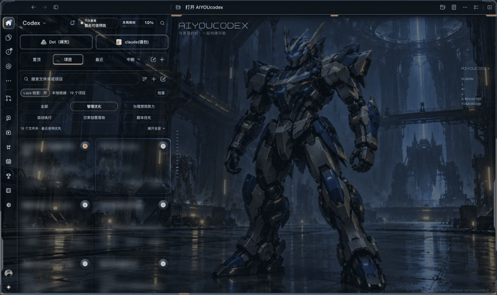
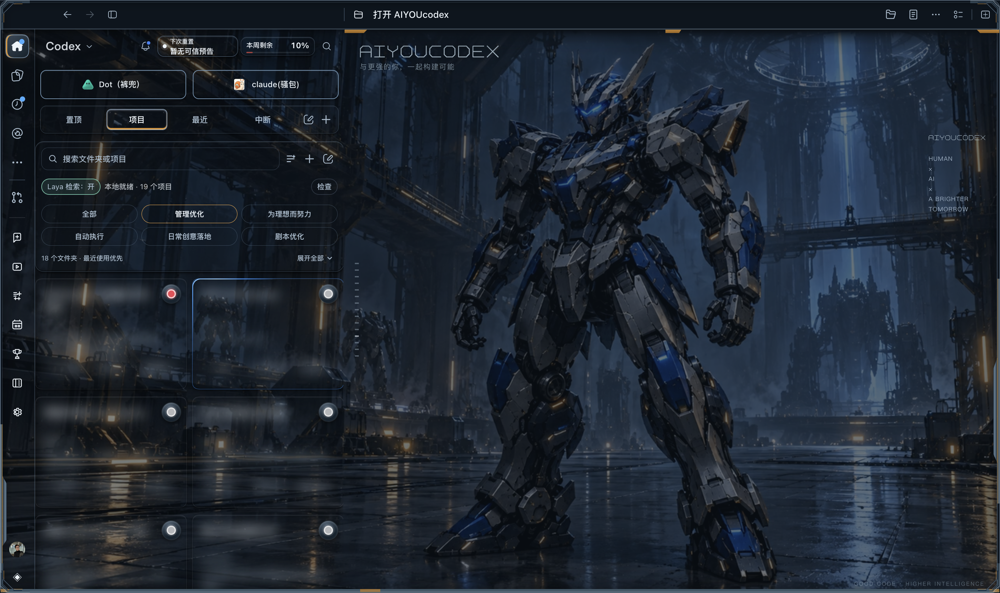
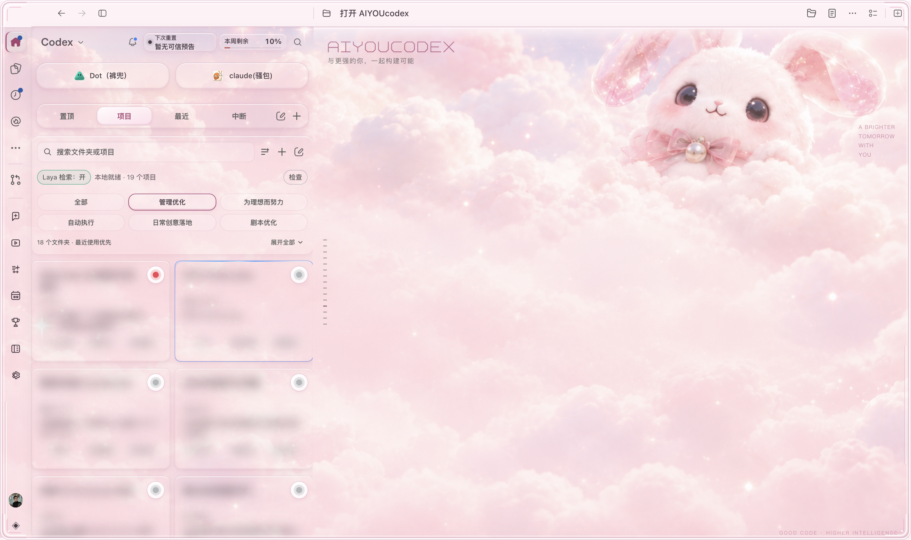
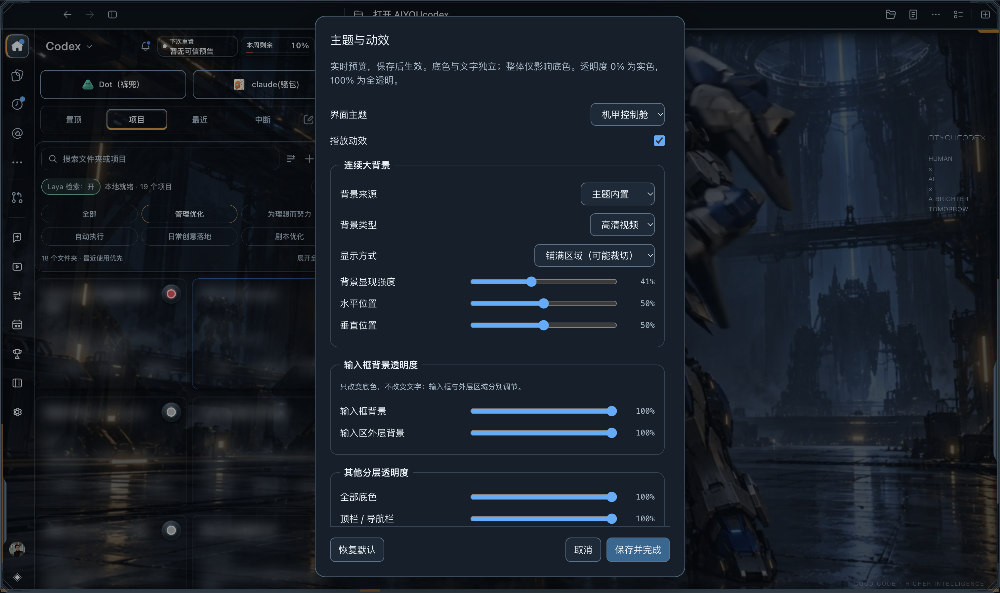
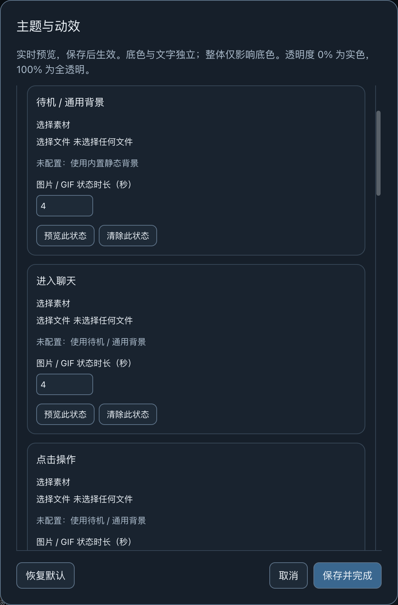
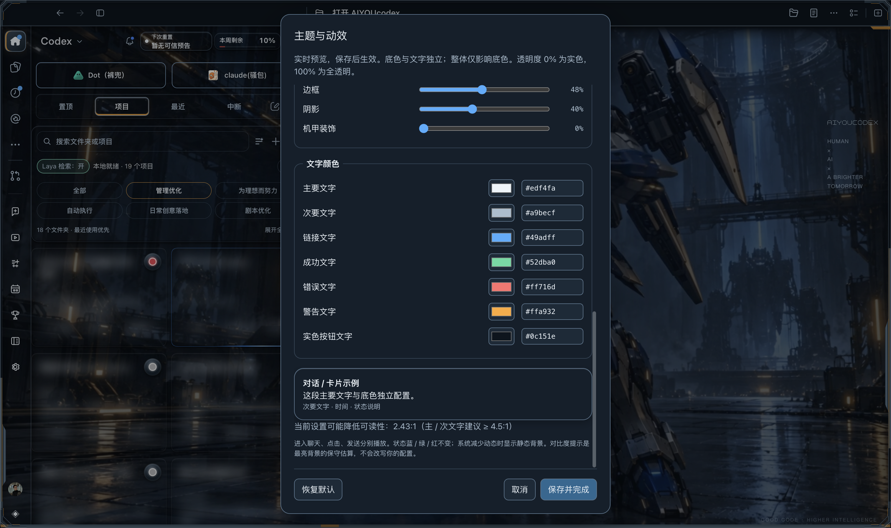
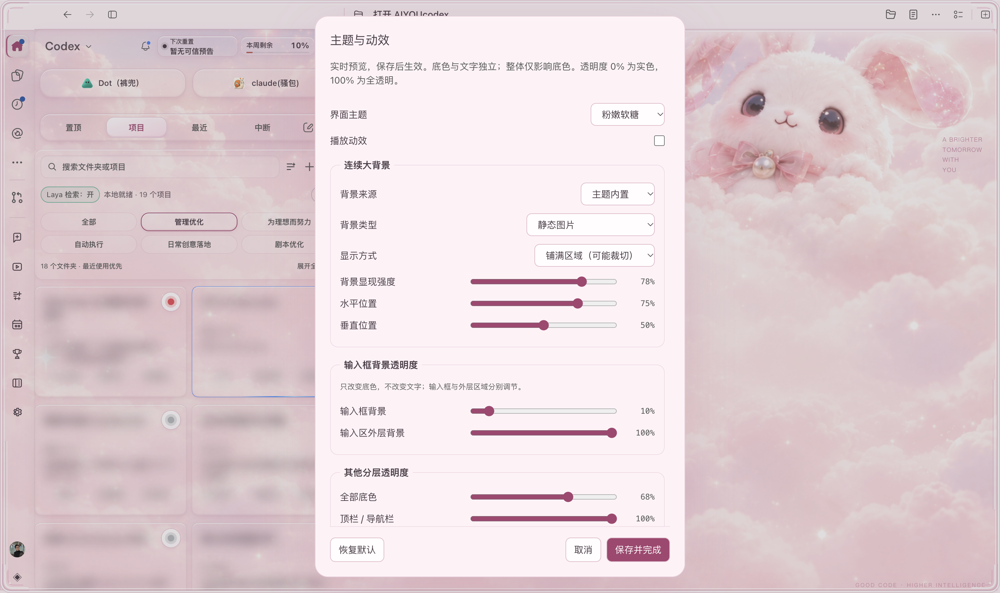

# 主题独立下载与配置

| 主题 | 标记 / 署名 | 独立下载 |
|---|---|---|
| 机甲控制舱 v1.4.3 | 内置主题 | [下载 ZIP](https://github.com/yubowen123/AIYOUCODEX/releases/download/v1.5.1/aiyoucodex-theme-mecha-control-v1.4.3.zip) |
| 粉嫩软糖 v1.0.4 | 内置主题 | [下载 ZIP](https://github.com/yubowen123/AIYOUCODEX/releases/download/v1.5.1/aiyoucodex-theme-pink-candy-v1.0.4.zip) |
| 海边度假·浠浠 v1.2.0 | ⭐ 社区共创 · 特别鸣谢浠浠（xixi），主题设计 | [下载 ZIP](https://github.com/yubowen123/AIYOUCODEX/releases/download/v1.5.1/aiyoucodex-theme-beach-vacation-xixi-v1.2.0.zip) |
| 海底假日·海绵宝宝 v1.0.2 | ⭐ 社区共创 · 特别鸣谢浠浠（xixi），主题设计 | [下载 ZIP](https://github.com/yubowen123/AIYOUCODEX/releases/download/v1.5.1/aiyoucodex-theme-spongebob-beach-motion-xixi-v1.0.2.zip) |

新增海底假日主题修复了重挂载后的动效失效、自定义背景叠加人物、气泡留白、发送按钮对比度和设置名称。25 项隔离验证通过；原生安装和界面效果尚未实测。[修复记录与隔离预览](THEME-SPONGEBOB-v1.0.2.md)。

更新 AIYOUcodex v1.5.1 后可安装任意独立主题。主题包包含源文件与必要素材，不包含账号、对话或个人媒体。主题名下方链接直接下载 GitHub Release 附件；源文件各自位于 `themes/` 的独立目录。

## 对话卡片颜色与流光

在「主题与动效」找到「对话卡片颜色与流光」。动态模式分别设置执行中、已完成、执行中断、待执行 / 空闲；静态模式统一所有卡片。每组支持背景色、边框色、边框粗细（0–8px）、流光颜色与开关。背景沿用卡片与整体底色透明度；边框 / 流光沿用边框透明度。文字独立。

预览可取消恢复；保存后持久化。已读 / 未读完成共用完成颜色，错误 / 中断共用中断颜色；不改变原有执行状态。减少动态或关闭播放动效时停止流光动画。新增控件通过隔离浏览器验证，原生人工验收仍待完成。

## ⭐ 特别鸣谢

浠浠（xixi）：海边度假、海底假日主题设计 / 社区贡献者。主题设置、下载页和 manifest 保留署名与特别标记。素材许可说明见 [海边度假](../themes/beach-vacation/ASSET-NOTICE.md) / [海底假日](../themes/spongebob-beach-motion/ASSET-NOTICE.md)。

## 既有主题、动效与自动恢复

AIYOUcodex v1.5.0 将主题作为独立可安装组件。机甲控制舱 v1.4.2 与粉嫩软糖 v1.0.2 可以同时存在，通过「主题与动效」选择，设置分别保存；安装新皮肤不删除旧皮肤。系统默认选项移除皮肤并恢复原生界面。

## 当前原生窗口实录

以下图片和 GIF 均由当前原生 Codex 窗口截取或录制，不是设计稿或模拟页面。私人对话、项目摘要与输入草稿已隐藏或模糊；录制没有发送消息。机甲素材来自当前 v1.4.2，而非旧版局部机甲截图。







## 安装与切换

先按 README 更新 AIYOUcodex v1.5.0。macOS 默认安装目录中的两个皮肤均可通过以下命令注册；命令使用独立目录注册，不改原生应用包，不发送消息。

```sh
AIYOU_RUNTIME="$HOME/Library/Application Support/Codex Sidebar Enhancer"
node "$AIYOU_RUNTIME/scripts/install-theme.mjs" --theme mecha-control
node "$AIYOU_RUNTIME/scripts/install-theme.mjs" --theme pink-candy
```

然后打开 AIYOUcodex，在侧栏设置中的「主题与动效」切换。可先加 `--dry-run` 校验资源和配色。自建主题使用 `--package /path/to/theme`；安装到非默认目录时加 `--install-dir /path/to/runtime`。

默认保持已有主题选择；首次安装主题才使用该主题作为初始项。更新基础增强时，安装器保留已有主题目录和个人本地媒体。macOS 自动启动服务只在安装、更新或打开 AIYOUcodex 时维护，正常重复打开不会重启健康服务。

## 自定义配置



- 连续背景支持静态图片、GIF 和视频；可调整覆盖方式、水平/垂直位置和背景显现强度。
- 自定义媒体支持七个槽位：待机/通用、进入、点击、发送、执行中、完成未读、错误/网络异常。缺少事件媒体时回退通用背景。
- 输入框内部与输入区外层背景分别控制；其他底色、边框、阴影、装饰及文字也独立配置。透明度 0% 表示实色，100% 表示透明。
- 主文字、辅助文字、链接、成功、错误、警告和实色按钮文字有独立颜色；显示真实对比度提示，不强制覆盖用户配置。
- 预览可以取消恢复；保存后持久化；系统减少动态效果或媒体加载失败时使用静态回退。
- 点击反馈不代表消息发送成功；只有确认发送后才播放发送状态，不会代替用户点击或修改原生执行状态。







## 重启与自动恢复

macOS 安装器同时写入并启用登录启动项和增强恢复服务；主题安装器写入并启用主题服务。安装不会仅写 plist：它还清除 launchd 独立保存的禁用标记，并对旧服务退出期间的注册冲突做有界重试。

电脑重启并登录后打开 AIYOUcodex，增强和主题服务自动连接。直接打开未带连接参数的原生 Codex 时，后台只能在空闲且回复状态可核实时内部重开一次补齐参数；已有调试端口的宿主不会因此重启。用户主动退出时不会无限拉起应用。

任务卡的 `in_progress` 不直接等于模型正在回复：明确的会话结束事件可以解除过期任务卡阻挡；活动或未知状态仍会延后恢复。恢复保持当前账户的数据目录。登录启动仅运行一次，增强与主题后台服务保活。

## 主题生成 Skill

仓库提供 [`skills/aiyoucodex-theme-builder`](../skills/aiyoucodex-theme-builder/SKILL.md)。复制该目录到自己的 Codex `skills` 目录后，可以请求：

> 使用 $aiyoucodex-theme-builder，按照这张参考图制作 AIYOUcodex 主题，保留现有皮肤，主体融入聊天区域，先验证静态界面再按要求添加动效。

Skill 提供独立身份模板、主题契约、色卡/资源检查和原生验证流程；不会自动发布、发送消息或调用视频生成。新主题默认独立设置，不与机甲或粉嫩软糖共享个人配置。

## 验证范围

已核对当前 macOS 原生窗口、两套主题、动态录制、配置页、取消恢复、模块重新连接、登录启动项启用及重复打开不重启服务；通过源码和安装相关回归检查。整机重启和 Windows 原生主题效果未在本次实机验证。默认色卡校验通过不代表任意个人透明度配置都保证足够对比度。
