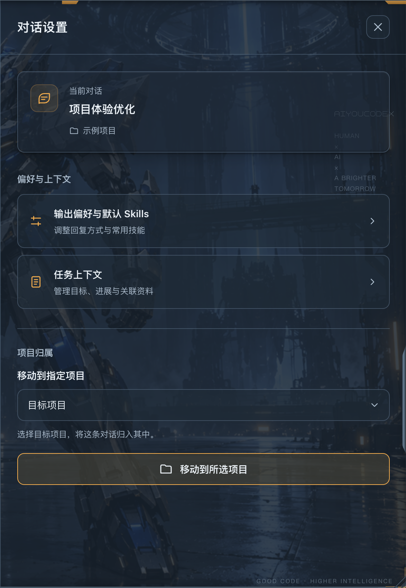
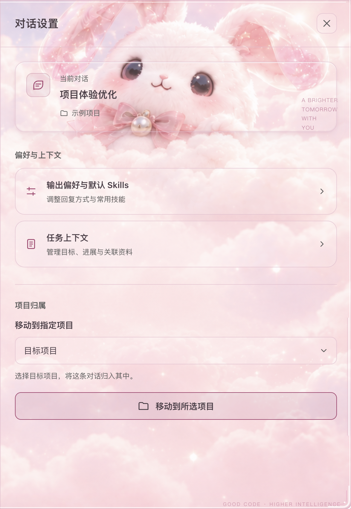
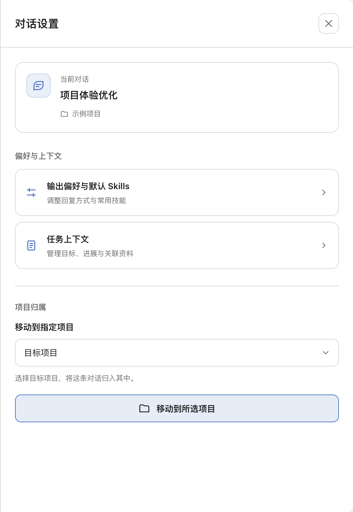

# 2026-10-07：侧边面板、主题适配与重置追踪

**与更强的你，一起构建可能。** 这次更新让扩展功能保留聊天空间，让对话设置跟随当前皮肤，并把重置信号的来源、预告与到账状态分开呈现。

## 对话设置与三套主题

对话设置此前只有基础排版，使用原生不透明背景，机甲主题下出现突兀的黑底和裸按钮。现在对话信息、偏好入口、任务上下文及项目移动按卡片组织；图标、按钮、边框、圆角和焦点状态统一。背景、文本、强调色和透明度直接读取现有主题变量，升级不替换皮肤或用户配置。

### 机甲控制舱

### 粉嫩软糖

### 默认主题

三张图均为本轮原生界面截图，仅匿名化对话与项目名称；未改变项目关联或对话正文。截图沿用本机透明度设置，不代表所有皮肤的初始透明度。

## 扩展功能在右侧并排

Skills、Claude、模型竞技场、项目管理、设置、重置详情及 Skill 介绍统一使用共享右侧布局。面板实际占用宽度，聊天区域随之调整，不覆盖聊天输入区；关闭面板后聊天空间恢复。沿用面板互斥、宽度调整与 Escape 关闭。

## 项目归属与新建对话

卡片右键打开对话设置，可选择同一主机上的目标项目。保存使用原生项目归属服务；同名对话按准确 ID 处理，列表读回确认前不显示成功，失败或状态不明不自动重试。当前项目内点击新建，默认携带项目与工作目录；远程项目仍交给原生远程连接处理，不把远程路径作为本地目录。

## Tibo 帖子、回复与重置概率

RSS 采集覆盖帖子及回复，记录来源类型、被引用帖子和去重键。回复内容可补充重置意愿、预告及完成信息；采集失败保留已有记录。已完成公告会使较早预告停止作为有效的下一次重置承诺。

顶部聚焦未来 24 小时重置概率估计；详情保留来源、完成记录和数据新鲜度。无足够信号时显示待估计，不把未知写成 0%。概率是公开信号的规则估计，未经统计校准；它与证据评分、公告适用范围和个人账号实际到账是不同信息。公开转发不能证明账号实际到账。

## 验证范围

- 发布前整体回归：570 项检查中 569 通过、0 失败，1 项 Windows 原生安装检查在 macOS 下按平台跳过；覆盖侧栏、并排面板、主题、重置、项目归属与安装/卸载。
- 额外修复缺少原生 main 标记时的并排兜底、固定顶栏的聊天锚点识别、窄窗口缩放和面板挂载失败时保留已有设置。
- 当前 macOS Codex 实机核对机甲、粉嫩软糖和默认主题；关闭按钮、两个设置入口、项目选择器及移动按钮均可命中，无水平溢出，面板与聊天不重叠。
- 预览结束恢复原主题及个人偏好，对话上下文和输入草稿保持一致。
- 原生项目移动已验证准确目标与模拟持久化读回；本轮未移动真实用户对话。Windows 原生视觉与整机重启未重新实测。

本次为源码更新，不覆盖既有发行版的 tag 或安装包。离线安装包的其他本地开发改动未纳入本次提交。
