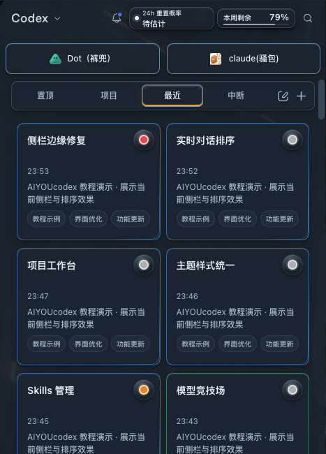
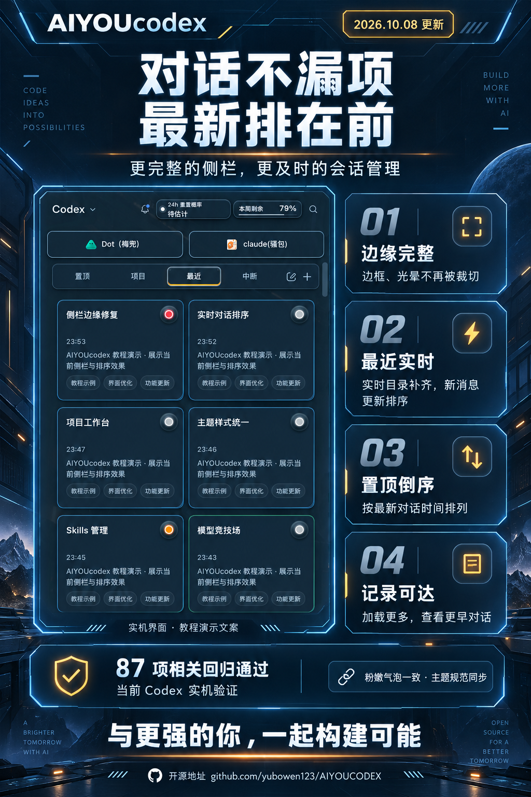

# 侧栏与对话排序修复 · 2026-10-08

最近使用的对话曾受旧索引、首批展示上限及延迟快照影响，导致新对话漏项或位置滞后；置顶列表沿用置顶操作时间，侧栏卡片的边缘贴着原生裁切边界。本次修复让最新对话更容易找到，同时保留原主题、对话和输入草稿。

## 最终行为

- 侧栏滚动区与卡片网格保留边缘留白，边框和状态光晕完整显示。
- 只读原生会话 SQLite/WAL 元数据，与旧 JSONL 索引合并；兼容旧数据库结构及索引缺失，排除已归档会话和子 Agent 记录。
- 页面每约 3 秒读取已加载的原生会话元数据。后台目录继续按原有节奏刷新，旧快照不会覆盖较新的原生元数据。
- 最近与原生/虚拟置顶采用相同的最新对话活动时间排序；卡片显示时间与排序依据同步。文件修改时间本身不会冒充真实对话活动。
- 最近首批展示 30 条，并通过“加载更多”访问更早记录。置顶仍归入独立置顶入口。
- 新卡片在同一次渲染中补齐样式、时间和状态，保持双列从左到右、从上到下。
- 粉嫩软糖的用户与助手气泡不再依赖临时聊天背景标记，聊天区域重建后继续保持一致的内边距、圆角和阴影。
- 主题 Skill 增加插件展开/还原、关闭按钮、拖动边界及原生顶栏避让的适配标准。

## 验证

87 项侧栏和相关专项测试全部通过，覆盖实时 WAL、无索引新会话、归档排除、旧 schema、实际用户/助手事件、旧快照回退、原生与虚拟置顶、分页、裁切边界、宿主重绘、CDP 重连以及关联模块。当前 Codex 的项目/最近/置顶无横向溢出，26 条置顶按最新活动倒序；实机加载更多从 90 条增长至 120 条。主题设置、当前对话和输入草稿保持一致。

主题气泡另有浏览器回归覆盖聊天区域背景标记被替换的情况。测试仅验证实现行为，不代表所有后续 Codex 版本都已验证。

## 当前实机界面

截图直接来自本机 Codex；仅将可见卡片文案临时替换为公开教程示例，截图后立即恢复，未改会话存储或业务数据。

## 更新卡片

由 Codex 内置 Image 生成，使用当前实机演示截图作为素材。

**与更强的你，一起构建可能。**

[开源仓库](https://github.com/yubowen123/AIYOUCODEX)
