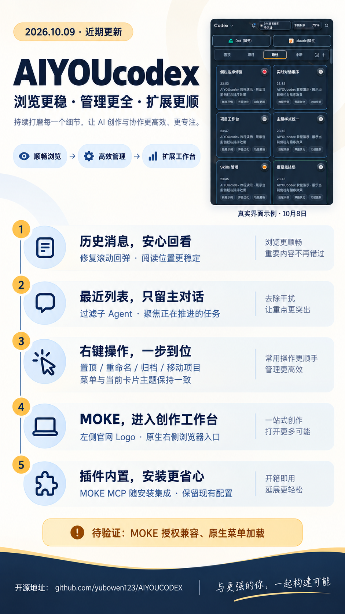

# 对话体验与 MOKE 接入更新 · 2026-10-09

本次更新改善历史阅读、主对话导航与日常管理，并为创作网站增加统一入口。

## 交互变化

- **历史阅读**：原生历史列表继续管理自身高度，去除重复恢复消息和高度覆盖；回退列表在消息变化时保持可见消息锚点，减少回弹。
- **最近列表**：从原生会话与本地记录读取子 Agent 来源与父子关系，过滤子对话；延迟目录更新和缓存恢复时继续保留过滤结果。
- **右键菜单**：补齐对话设置、置顶/取消置顶、重命名、移动到指定项目、归档。颜色、边框、圆角和阴影跟随卡片主题；支持键盘操作与窗口边缘定位。按宿主与会话标识执行操作，原生确认成功后才更新状态。
- **主题标准**：主题制作 Skill 的契约补齐右键菜单标准，后续主题需覆盖该交互面。

## MOKE 网站与插件

- 左侧默认入口使用官网原始 Logo，可在快捷入口设置隐藏/显示。
- 网站通过 Codex 原生右侧浏览器打开。每次点击明确请求显示官网地址，避免过期标签标识导致页面无法打开。官网限制 iframe 嵌入，因此不绕过该限制。
- 安装器内置 MOKE MCP 插件及使用 Skill，支持 macOS 与 Windows 安装脚本；安装保持幂等，保留其他插件、已有同名连接与禁用偏好；卸载仅清理本项目注册的集成。
- 插件连接官方服务，是 AIYOUcodex 提供的第三方集成。凭证仍由宿主保管，仓库不包含账号秘密。

### 待验证与限制

**安装完成不等于授权完成。** 10 月 9 日本机授权返回 `Authorization server response missing required issuer`，MOKE OAuth 与当前 Codex 校验的兼容问题尚未解决。未声称资源查询已连通。

MOKE 原生菜单点击后的最终页面加载尚未完成实机确认；隔离浏览器验证仅覆盖打开协议。Windows 的实际安装和桌面效果尚未实机确认。保留既有发行包版本，不将源码更新描述成新发行包。

## 验证

macOS 全量回归 590 项：汇总 589 通过、1 Windows 平台跳过。发布目录补齐隐藏插件注册文件后，两项安装失败用例复验通过（安装专项 3/3）。独立任务活动回归 4/4；公开包边界、shell 语法与 Git 差异检查通过。

专项覆盖滚动锚点、子 Agent 过滤、菜单操作确认、跨宿主标识、MOKE 入口打开协议、插件幂等安装及公开安装包边界。

## 更新卡片

卡片使用 Codex Image 生成。界面插图为 10 月 8 日真实教程截图，不代表本次新增控件的实机验收。

**与更强的你，一起构建可能。**
